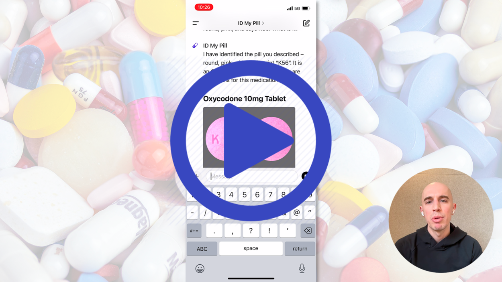
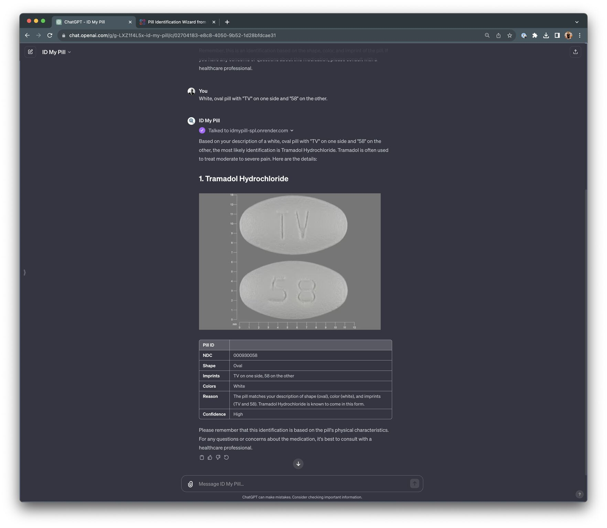

# ID My Pill


<a href="https://youtu.be/5Rl2EqhfiiY" target="_blank"></a>

Adverse Drug Events (ADEs) cause an estimated **46 million adverse reactions** per year in the United States [1], resulting in:

- 1.5 million emergency department visits
- 500,000 hospitalizations
- 250,000 deaths

Many of these ADEs can be attributed to patients taking the incorrect medication, either due to the patient confusing their medication, the pharmacist filling the prescription erroneously, or the physician prescribing the incorrect medication.

One simple solution to help prevent these ADEs is for the patient to _manually verify_ their prescription pills before taking them.

However, existing tools are slow, tedious, and error prone, requiring the patient to use traditional web-based forms to select the pill:

- Color
- Shape
- Size
- Imprint
- Texture
- etc.

This task becomes _extremely_ challenging when it comes to prescription pill identification given that _over half_ of the 20,000 pills on the US market are round and/or white [2,3].

ID My Pill helps address this problem by turning that tedious web form into a plain-language conversation using LLMs.

You can either:

- Upload a photo of the pill
- Or, describe it in plain English: "round, yellow, TEVA on one side and 3926 on the other"

A custom GPT is then used to parse the input. For text, it parses the user query into the pill's shape, color, and imprint. For a photo, the GPT uses its own vision capabilities to extract the shape, color, and imprint (however, the vision extraction will be far less accurate, which is an obstacle we overcome later in this project).

The identification itself happens under the hood via a novel combination of (1) co-occurrence search engine built specifically for pill identification, followed by (2) a custom re-ranking system.

**Telling 20,000 pills apart is hard precisely because most of them look alike.** More than half the market is round and/or white, so those features barely narrow the search space on their own.

The ID My Pill engine gets around this by learning, straight from the data, which combinations of shape, color, and imprint characters are rare enough to actually identify a pill. It leans on those and discounts the ones nearly every pill shares, so the imprint (the most distinctive dimension a pill carries) ends up doing most of the work.

> **ID My Pill is an educational and informational tool. It is not medical advice, and it must not be used to decide whether to take, skip, or dose any medication.**
>
> Pill identification can be wrong. Always confirm any medication with a licensed pharmacist or physician before acting on it.

## How accurate is ID My Pill?

To measure identification accuracy, the [`evaluate_search`](apps/pill_id/management/commands/evaluate_search.py) command searches for **every** pill in the database using that pill's own shape, color, and imprint, then records where the correct pill lands in the returned candidates. To simulate a user misreading an imprint, `--imprint-jitter` trims a fraction of the imprint's characters before searching.

**The right way to read these results is to first set aside the pills that can never be identified.** Of the 43,202 pill records in the GSDB database, **2,902 (6.7%) carry no typeable imprint at all.** Their only marking is a manufacturer logo or a decorative embellishment, which ingestion drops because a logo cannot be typed by a user or read from a photo (see [What a GSDB record looks like](#what-a-gsdb-record-looks-like)). There is nothing on these pills to search on, so *no* imprint-based method can ever identify them.

When reporting accuracy, we drop those 2,902 and evaluate on the **~40,300 pills that actually carry a distinguishing imprint** (i.e., the pills for which identification is even possible).

| Imprint jitter | Recall@100 | Median position | Mean position | Worst position |
|---|---|---|---|---|
| 0% (exact imprint) | ≈100% | 1 | 2.0 | 21 |
| 5% | ≈100% | 1 | 2.0 | 21 |
| 10% | ≈100% | 1 | 2.0 | 24 |
| 15% | 99.99% | 1 | 2.0 | 24 |
| 20% | 99.94% | 1 | 2.3 | 43 |
| 25% | 99.53% | 2 | 2.7 | 67 |
| 50% | 93.2% | 7 | 12.9 | 100+ |

`Recall@100` is the share of searches where the correct pill appears among the top-100 candidates the engine returns. "Position" is that pill's rank in the returned list (1 = top result). The corpus is **43,202 pill records** (GSDB versions each pill, so a single design can appear several times).

We treat "landing in the top 100" as a correct identification because those 100 candidates are _exactly_ the shortlist the engine hands off to the GPT. The search's job is not to make the final call, it is to guarantee the correct pill is somewhere in the set the GPT then reviews and picks from (steps 3–4 of the [pipeline](#how-pill-identification-is-performed)). 

A pill that never reaches the top 100 is invisible to the GPT and can never be surfaced to the user; a pill that does reach it is in play. And because the re-ranking step orders that shortlist by how well each candidate's imprint actually matches the query, the correct pill does not just squeak into the 100, it rises toward the top of it. That is what the top rows of the position columns show: for a cleanly-to-realistically read imprint, a median rank of **1** and a mean of **~2**, so the right pill is usually the first or second candidate the GPT ever sees, and a correct final identification follows.

**On every pill with valid imprints, ID My Pill recovers the correct pill more than 99% of the time,** effectively 100% on a cleanly read imprint, and never dropping below 99.5% even after a quarter of the imprint's characters are removed.

That robustness degrades gracefully rather than falling off a cliff. Even with **half** the imprint removed (a far harsher corruption than any realistic misread) the engine still surfaces 93% of identifiable pills, with the correct one typically inside the top 7. The realistic operating range is the top of the table, where recovery holds at 99%+ and the right pill sits at rank 1 or 2. 

## What ID My Pill does



A person holds a mystery pill and wants to know what it is.

They describe it in plain language, something like: 

> _"Oval, white, 'TV' on one side and '58' on the other."_ 

Most people have _zero knowledge_ of prescription drugs, and they are often stressed, in a rush, or ill when they ask. The whole product is built around meeting them there.

The custom GPT component acts as the interface to the user, while our implementation handles the actual identification.

## How pill identification is performed

At a high level, here is a single identification, start to finish:

```
1. User          describes a pill: shape, color, and any imprint text
2. Custom GPT    extracts the structured fields from the text or a photo
3. id_pill       ranks every pill in the database against that description
4. Custom GPT    reviews the candidates and picks the most likely matches
5. pill_info     returns full details for those matches (name, image, NDC, DEA schedule)
6. Custom GPT    renders a friendly Markdown answer, including the pill image
```

The API exposes exactly two endpoints for steps 3 and 5. Everything else is the GPT doing fuzzy, human-facing reasoning that an LLM is good at.

## The Elsevier Gold Standard Drug Database (GSDB)

Every pill in this project comes from the **Gold Standard Drug Database (GSDB), Elsevier's commercial drug information system.** 

This database is a professionally curated dataset of US drug products, updated daily by board-certified pharmacists and used inside hospitals and pharmacies for clinical decision support, order entry, and dispensing. You can read more on [Elsevier's product page](https://www.elsevier.com/products/gold-standard-drug-database).

GSDB is a massive, broad database, including drug interactions, a 32-level ingredient-to-product hierarchy, and standard identifiers like NDC and RxNorm. This project uses one narrow slice of it: the physical description of each dispensed pill, along with the pill images.

For every oral drug, GSDB records its shape, its colors, the imprint stamped on each side, its National Drug Code (NDC), its DEA schedule, and a reference photograph. That combination is exactly what pill identification needs, tied together and kept current, which is why it is the backbone here.

Public alternatives are thin by comparison. The FDA's Pillbox [4], the obvious free option, was retired in 2021.

**Note that GSDB is proprietary and paid. There is no free tier and no public download. Access requires a commercial license from Elsevier, arranged by contacting them directly.**

This repository ships _without_ GSDB data, as the license does not allow redistributing it. 

**To run the full pipeline you need to supply your own GSDB export.**

This project assumes you: 

1. Hold a valid license for the GSDB database
2. Currently have an export of the database residing on disk

The code in this project reads a specific set of pipe-delimited tables and a directory of pill images:

| File (in `data/gsdb/`) | GSDB table | What the project reads from it |
|---|---|---|
| `Drug_Item.txt` | drug items | which items are oral dosage forms |
| `Drug_Item_Version.txt` | drug item versions | the free-text description that shape, color, and imprint are parsed out of |
| `Product.txt` | products | NDC and the short product (drug) name |
| `DEA_Classification.txt` | DEA classification | the controlled-substance schedule |
| `Route_Of_Administration.txt` | routes | the ID of the "oral" route (only oral pills are considered) |
| `Color.txt` | colors | the set of valid color names |
| `Shape.txt` | shapes | reference shape names |
| `_GSDD_DrugItem_ImageList.txt` | drug images | the image filename for each drug/version/NDC |
| `DrugItem_Images/` | (image archive) | the actual pill photos, unzipped from `DrugItem_Images.zip` |

The exact table-to-filename mapping lives in [`apps/gsdb_datalab/gsdb/data/gsdb_table_filenames.json`](apps/gsdb_datalab/gsdb/data/gsdb_table_filenames.json). If your GSDB export names files differently, edit that mapping.

### What a GSDB record looks like

The physical description of a pill lives in a single free-text field on each drug version, and the ingestion pipeline parses it into a structured shape, colors, and imprint. 

For example, given the following input:

```
round-shaped, white, side 1: L 612, side 2: logo
```

The parser turns that into:

- **Shape:** `round`
- **Colors:** `["white"]`
- **Imprints:** `["l", "612"]` (the `logo` token is dropped, since a manufacturer logo cannot be typed by a user or read from a photo)

Each drug version also points at a reference image in `DrugItem_Images/`. That image is what the API hands back so a user can visually confirm the match with their own eyes.

## How the repository is organized

```
idmypill-spl/
├── apps/
│   ├── gsdb_datalab/              # ingests the GSDB export into the database
│   │   ├── gsdb/                  # the parsing pipeline (loaders, parsers, schemas)
│   │   ├── management/commands/
│   │   │   ├── ingest_gsdb.py
│   │   │   └── build_production_images.py
│   │   └── models.py             # RxName, RxPill, RxPillImage
│   ├── pill_id/                  # the identification engine (no database models)
│   │   ├── identification/       # co-occurrence matrix + two-stage search
│   │   └── management/commands/
│   │       ├── build_cooccurrence_matrix.py
│   │       ├── evaluate_search.py
│   │       └── test_coo.py
│   └── pill_api/                 # the public HTTP API (Django Ninja)
│       ├── v1/                   # endpoints, request/response schemas, auth
│       ├── management/commands/create_api_key.py
│       └── models.py             # APIKey, APILog
├── gpt/                          # the custom GPT half of the product
│   ├── instructions.txt          # the GPT system prompt
│   └── openapi_schema.yaml       # the Action schema the GPT calls
├── idmypill_spl/                 # Django project (settings, urls, wsgi/asgi)
├── deploy/build.sh               # Render build script
├── data/                         # GSDB export + coo_matrix.pkl (git-ignored, you provide)
├── render.yaml                   # Render deployment config
├── requirements/                 # pip-compile sources and lockfiles
└── sample.env                    # copy to .env and fill in
```

The primary components of this project are split across three Django apps:

1. `gsdb_datalab`: Handles data ingestion. Parses the GSDB tables, stores each pill as an `RxPill` (with its shape, colors, and imprints), and associates `RxPill` objects with pill images via `RxPillImage`.
2. `pill_id`: Handles pill identification, including building the co-occurrence matrix from the pills in the database and running the two-stage search described below.
3. `pill_api`: Handles the API, exposing the `id_pill` and `pill_info` endpoints through Django Ninja, checking the `X-API-Key` header against the `APIKey` model, and logging every request and response to `APILog`.

## Why the search uses a co-occurrence matrix

The obvious ways to create a pill identification system all fail for the same reason: the input is unreliable and the features are weak.

- An exact database lookup breaks the moment a user reads an imprint slightly wrong, flips the two sides, or drops a character. 
- A trained classifier needs a large labeled dataset and then hides its reasoning inside weights you cannot inspect. 
- Embedding every pill into a vector space adds cost and opacity to a problem that does not obviously need either.

**The deeper problem is that a pill's most obvious features barely mean anything. More than half of all pills are round and/or white, so those two features carry very little identifying information. Any method that treats every feature as equally useful starts from the wrong place.**

The co-occurrence approach turns that weakness into the ranking signal itself. It indexes every combination of shape, color, and single imprint character, and weights each combination by how rare it is across the whole database.

A common combination like `round-white-"1"` counts for almost nothing. A rare one counts for a lot, such as `oval-white-"TV"-"53"`.

**Additionally, the co-occurrence weighting is inferred directly from the data, so the engine decides what is discriminative on its own, with nothing to train and nothing to hand-tune.**

Effectively, this method is not unlike [inverse document frequency](https://en.wikipedia.org/wiki/Tf%E2%80%93idf) in text search, applied to the physical features of a pill.

The benefits of this approach include:

- **Fast:** The matrix is precomputed once, so a query is a handful of dictionary lookups instead of a scan over 20,000 pills
- **Interpretable:** You can see _exactly_ which feature combinations pushed a given pill up the ranking
- **No training:** There is no model to collect data for, fit, or retrain when the database changes
- **Forgiving:** Coarse shape and color buckets plus an imprint re-rank absorb the mistakes real people make

The next section walks through exactly how that matrix is built and searched.

## How the pill search actually works

**Identifying a pill from a description is effectively a ranking problem.**

The United States drug market covers 20,000+ pills. A person hands you a fuzzy, partial description ("round, yellow, some letters and numbers"), and you need to surface the handful of pills most likely to match. 

Two aspects make this hard: 

1. People describe shape and color unreliably
2. Imprints get misread, reordered, or, in some cases, are not easily identifiable

The engine handles this in two stages. **Stage one casts a wide, fast net using the shape, color, and imprint characters. Stage two re-ranks the survivors by how well their imprint string actually matches.**

Before either stage runs, the query gets expanded and cleaned.

### Query expansion and sanitization

People can reliably tell round from not-round, and white from colored. They are _far less reliable_ about the difference between oval, oblong, and capsule, or between beige, tan, and peach. The search leans into what people get right and forgives what they get wrong.

The shape is bucketed into round versus everything else. If the query shape is `round`, the search stays with round. Any non-round shape expands to _all_ non-round shapes, so `oval` and `oblong` and `capsule` are searched together.

Color works the same way. The color `white` stays white, while any non-white color expands to _all_ non-white colors.

The imprint is lowercased, stripped of whitespace, and concatenated into a single string. The imprint `"L 612"` becomes `"l612"`.

The expansion and sanitization is deliberately coarse, trading precision for recall, as our co-occurrence search and re-ranking step will narrow the search space further.

### Shape, color, and imprint co-occurrence matrix

Our [co-occurrence matrix](https://en.wikipedia.org/wiki/Co-occurrence_matrix) is an [inverted index](https://en.wikipedia.org/wiki/Inverted_index), built once and serialized to disk.

For every combination of one shape, one color, and one single imprint character, we record the set of pills that have _all three_ at once. The key is the triple `shape` + `color` + `character`; the value is the list of matching pill indices. A metadata block records the total pill count.

The [`cooccurrence_matrix.py`](apps/pill_id/identification/cooccurrence_matrix.py) builder walks every `(shape, color, character)` triple across the vocabulary of the whole database and records which pills match the shape exactly, contain that color, and contain that character in their imprint. Precomputing this is what makes search fast at request time.

### Stage #1: Co-occurrence filter

Stage one scores candidates by discriminative power.

For each triple in the query (every combination of an expanded shape, an expanded color, and a character of the imprint), the filter looks up the matching pills and gives each of them a score. The score for a triple is its **importance**, defined as:

```
1 - (pills matching the triple / total pills)
```

A triple matched by thousands of pills (round, white, the digit "1") barely narrows anything, so its importance is near zero. A triple matched by only a few pills is strong evidence, so its importance is near one. It behaves like inverse document frequency in text search: rare signals count more.

Every pill accumulates importance across all the query triples it matches. A pill that hits many rare triples floats to the top. 

Stage one ends by keeping the top 1,000 potential matches.

### Stage #2: Re-ranking on the imprint

Stage one treats the imprint as a bag of characters, so it ignores order: `"l612"` and `"216l"` look identical to the co-occurrence matrix.

Stage two fixes that by scoring the actual imprint string. For each surviving candidate, it finds the longest common substring between the candidate's imprint and the query imprint, then scores it as:

```
len(common_substring) / len(pill_imprint) + len(common_substring) / len(query_imprint)
```

**The first term rewards a candidate whose imprint is mostly covered by the match. The second rewards a candidate that covers most of the query.** Adding them favors pills that both contain a long run of the query and are not padded with unrelated characters. 

Stage two keeps the top 100 candidate identifications.

### A worked example

Say the query is `oval`, `white`, imprint `L612`.

The shape `oval` is not round, so it expands to every non-round shape. The color `white` stays white. The imprint `L612` cleans to `l612` and splits into the characters `l`, `6`, `1`, `2`.

Stage one forms every `(non-round shape, white, character)` triple, looks each up, and adds its importance to every pill it points at. A white, non-round pill carrying several of those characters climbs the ranking.

Stage two then re-scores those candidates by the longest run of `l612` that actually appears in each imprint. A pill imprinted `l612` beats one imprinted `1620` that merely shares a couple of digits.

The GPT takes it from there, comparing the top candidates against the original description with its own fuzzy judgment and choosing the final handful to show the user.

## What you need before you start

1. Python 3.11 or newer
2. A GSDB license and data export (see [the Elsevier Gold Standard Drug Database](#the-elsevier-gold-standard-drug-database-gsdb) above)
3. Optionally, a static host or CDN if you want to serve pill images

Without the GSDB export you can still install the project and start the server, but the search will return nothing, because there are no pills to search (obviously).

## Setting up the project

Clone the repository and create a virtual environment:

```bash
git clone <your-fork-url> idmypill
cd idmypill
python -m venv venv
source venv/bin/activate
pip install -r requirements.txt
```

Create your environment file and generate a secret key:

```bash
cp sample.env .env
python -c "from django.core.management.utils import get_random_secret_key; print(get_random_secret_key())"
```

Paste that key into `DJANGO_SECRET_KEY` in `.env`. Local development uses SQLite and needs nothing else.

Run the migrations and mint an API key:

```bash
python manage.py migrate
python manage.py create_api_key
```

Every API request has to send the generated key in the `X-API-Key` header.

## Loading the GSDB data

Copy the pipe-delimited `.txt` tables into `data/gsdb/`, and unzip the images into `data/gsdb/DrugItem_Images/`:

```bash
mkdir -p data/gsdb
# copy Drug_Item.txt, Drug_Item_Version.txt, Product.txt, Color.txt,
# Shape.txt, Route_Of_Administration.txt, DEA_Classification.txt,
# and _GSDD_DrugItem_ImageList.txt into data/gsdb/
unzip DrugItem_Images.zip -d data/gsdb/DrugItem_Images
```

Ingest the pills into the database:

```bash
python manage.py ingest_gsdb
```

This parses every oral drug, extracts shape, colors, and imprints from the GSDB descriptions, and inserts them as `RxPill` rows. Pills that already exist (matched on NDC and version) are skipped, and pills whose description cannot be parsed are dropped.

Build the search index:

```bash
python manage.py build_cooccurrence_matrix
```

This reads every pill back out of the database and writes the co-occurrence matrix to `data/coo_matrix.pkl`. 

_**Note:** In order to prevent accidentally over-writing an existing COO matrix, this command will exit if the matrix _already_ exists on disk. If you intend on rebuilding the index, make sure you delete the old one before building._

Prepare the images for hosting (optional, only if you want images in the answers):

```bash
mkdir -p data/gsdb/DrugItem_ProductionImages
python manage.py build_production_images
```

This copies each pill image into `DrugItem_ProductionImages/` under a hashed filename. Upload that directory to whatever host you set as `PILL_IMAGES_URL`, and the API will hand back working image URLs.

## Running the API locally

Start the server:

```bash
python manage.py runserver
```

Django Ninja serves interactive API docs at `http://127.0.0.1:8000/api/v1/docs`.

Identify a pill (replace `YOUR_KEY` with the key from `create_api_key`):

```bash
curl -X POST http://127.0.0.1:8000/api/v1/id_pill/ \
  -H "Content-Type: application/json" \
  -H "X-API-Key: YOUR_KEY" \
  -d '{"shape": "oval", "colors": ["white"], "imprints": ["L612"]}'
```

You get back a ranked list of candidates, each with a score, name, NDC, shape, colors, and imprints.

Pull full details for one or more pills by NDC:

```bash
curl -X POST http://127.0.0.1:8000/api/v1/pill_info/ \
  -H "Content-Type: application/json" \
  -H "X-API-Key: YOUR_KEY" \
  -d '{"ndcs": ["00093-1036"]}'
```

The `pill_info` endpoint returns a single Markdown string: a table per drug with its name, image, NDC, shape, colors, and imprints, plus placeholder rows for usage and warnings that the GPT fills in.

## Management commands

| Command | App | What it does |
|---|---|---|
| `create_api_key [--key VALUE]` | `pill_api` | Creates an API key and prints it. Generates a random 32-character key, or uses the one you pass with `--key` |
| `ingest_gsdb [--verbose 1]` | `gsdb_datalab` | Parses the GSDB export and inserts oral drugs into the database |
| `build_cooccurrence_matrix [--matrix PATH]` | `pill_id` | Builds the search index and pickles it (skips if the file already exists) |
| `build_production_images [--verbose 1]` | `gsdb_datalab` | Copies pill images to hashed filenames for hosting |
| `evaluate_search [--imprint-jitter P]` | `pill_id` | Measures accuracy by searching for every known pill and recording where it lands in the results. `--imprint-jitter` trims a fraction of imprint characters to simulate misreads |
| `test_coo [--matrix PATH]` | `pill_id` | Runs one hardcoded query and prints the raw results (a quick smoke test) |

## Deploying to production

The repo is set up for [Render](https://render.com) via [`render.yaml`](render.yaml) and [`deploy/build.sh`](deploy/build.sh), but nothing here is Render-specific beyond that config.

Production runs under `idmypill_spl.settings_production`, which turns off debug, forces HTTPS, and switches the database to Postgres. Set these environment variables on the host:

- `DJANGO_SECRET_KEY` (Render can generate this for you)
- `DJANGO_ALLOWED_HOSTS` (your domain, comma-separated)
- `PILL_IMAGES_URL` (your image host base URL)
- the Postgres connection, either as `DATABASE_URL` or the individual `DJANGO_DATABASE_*` variables

The `deploy/build.sh` script expects your data directory (the GSDB tables and `coo_matrix.pkl`) to live on a persistent disk, and it symlinks `data/` to `IDMYPILL_DATA_DIR`. The build itself only installs dependencies, collects static files, and runs migrations. 

**Ingestion and index-building are not part of the deploy; run those yourself against the production database, then restart the service.**

## Wiring up the custom GPT

The [`gpt/`](gpt/) folder is the other half of the product. To rebuild the assistant:

1. Create a new custom GPT in ChatGPT (this needs a plan that supports building GPTs)
2. Paste the contents of [`gpt/instructions.txt`](gpt/instructions.txt) into the Instructions field
3. Add an Action and import [`gpt/openapi_schema.yaml`](gpt/openapi_schema.yaml), then set the `servers` URL to your deployed API's base URL (`https://your-domain/api/v1`)
4. Set the Action's authentication to API Key, with the header name `X-API-Key` and a key from `create_api_key`
5. Test it with a query like _"round, yellow pill with TEVA on one side and 3926 on the other"_

## Known limitations

- API keys are stored and compared in plaintext. That is fine for a single-owner research deployment, but add hashing and rate limiting before you expose it seriously.
- The co-occurrence matrix stores positional indices into the pill list ordered by database ID. Rebuild the matrix (and restart the API) whenever the set of pills changes, or the indices drift out of alignment.
- Only oral dosage forms are ingested. Injectables, topicals, and the like are skipped.
- Shape and color matching is coarse by design (round versus other, white versus other). The precise disambiguation happens in the GPT, not the API.
- Stage one of the filtering process treats the imprint as a bag of single characters (i.e., throwing away ordering that could be useful for identification). Indexing character bigrams as additional tokens (the same way you would add word bigrams to tf-idf) would sharpen the discriminative triples considerably at modest index cost (and bigrams over imprints are still a tiny vocabulary).
- Pills whose GSDB description cannot be parsed into a shape, color, and imprint are dropped during ingestion, so the searchable set is smaller than the raw export.
- The `tests.py` files are stubs. There is no meaningful automated test coverage yet.

## License

Released under the [MIT License](LICENSE).

The code is MIT. **The GSDB data is not, and this project does not grant you any right to it.** Bring your own GSDB license.

## Citation

If ID My Pill is useful in your own work, please cite it:

```bibtex
@software{ARosebrock_IDMyPill,
    author = {Adrian Rosebrock},
    title = {ID My Pill: Discriminative Co-occurrence Search for Prescription Pill Identification},
    year = {2026},
    url = {https://github.com/jrosebr1/idmypill},
}
```

## References

1. "New analysis suggests adverse drug events are the 3rd leading cause of death in the USA." _Practical Neurology_. https://practicalneurology.com/news/new-analysis-suggest-adverse-drug-events-are-the-3rd-leading-cause-of-death-in-the-usa/2473820/
2. U.S. Food & Drug Administration (PDF). https://www.fda.gov/media/143704/download
3. J. J. Caban, A. Rosebrock, and T. S. Yoo. "Automatic identification of prescription drugs using shape distribution models." _2012 19th IEEE International Conference on Image Processing_, pp. 1005–1008. https://scholar.google.com/citations?view_op=view_citation&hl=en&user=bLEhONMAAAAJ&citation_for_view=bLEhONMAAAAJ:u-x6o8ySG0sC
4. "Pillbox: Product Retirement." _U.S. National Library of Medicine Technical Bulletin_. https://www.nlm.nih.gov/pubs/techbull/ja20/ja20_pillbox_discontinue.html
